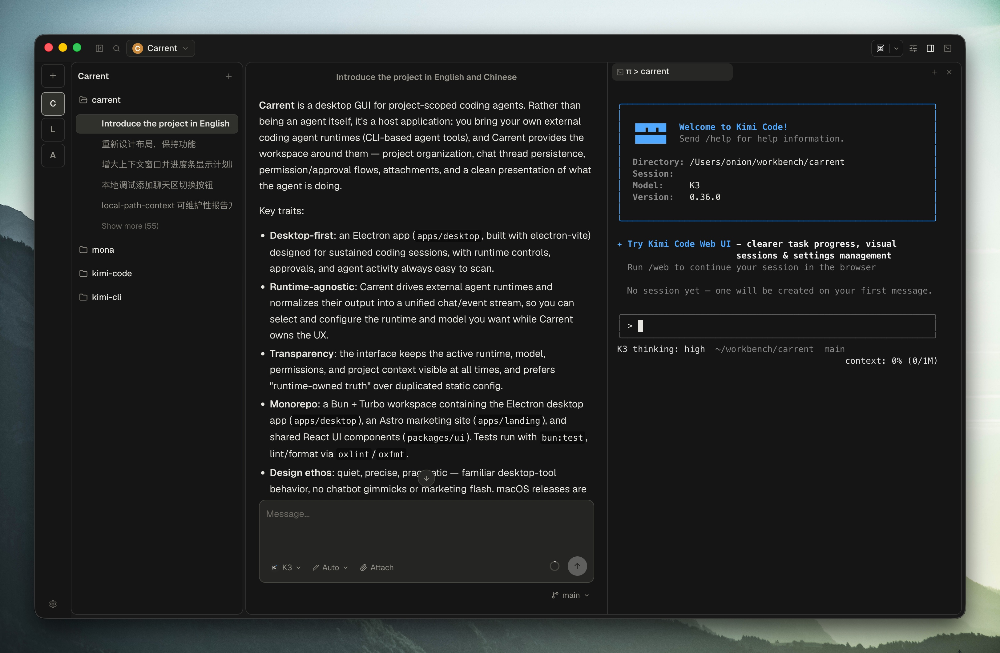

<p align="center">
  
</p>

<h1 align="center">Carrent</h1>

<p align="center">
  A calm, focused desktop workspace for Kimi Code.
</p>

<p align="center">
  
</p>

> **Note:** Carrent is a hobby project under active development. Major changes
> may happen at any time, and features and APIs may change without notice.
> Thank you to everyone who has taken an interest in and supported the project.

## What is Carrent?

Carrent is a desktop GUI for project-scoped coding work with
[Kimi Code](https://moonshotai.github.io/kimi-code/). Rather than being an agent itself, it's
a host application: Kimi Code provides the agent runtime, and Carrent provides
the workspace around it — project organization, chat thread persistence,
permission and approval flows, attachments, and a clean presentation of what
the agent is doing.

## Why Carrent?

- **Made for Kimi Code.** Carrent drives the Kimi Code CLI and presents its
  output as a clean, unified chat and event stream, purpose-built for how Kimi
  Code works.
- **Always know what's running.** The active model, permissions, and project
  context stay visible at all times. No hidden state, no surprises.
- **Built for long sessions.** Approvals, thread history, terminal sessions,
  and agent activity are designed to stay easy to scan without interrupting
  your flow.
- **A real desktop app.** Quiet, precise, and pragmatic — familiar desktop-tool
  behavior, no chatbot gimmicks or marketing flash.

## Get Carrent

macOS releases are signed and notarized DMGs for both Intel and Apple Silicon.
Grab the latest build from the
[Releases](https://github.com/Onion-L/carrent/releases) page.

## Development

Requires [Bun](https://bun.sh/).

```bash
bun install
bun run dev:desktop
```

See [CONTRIBUTING.md](CONTRIBUTING.md) and [AGENTS.md](AGENTS.md) for the full
development guide.
