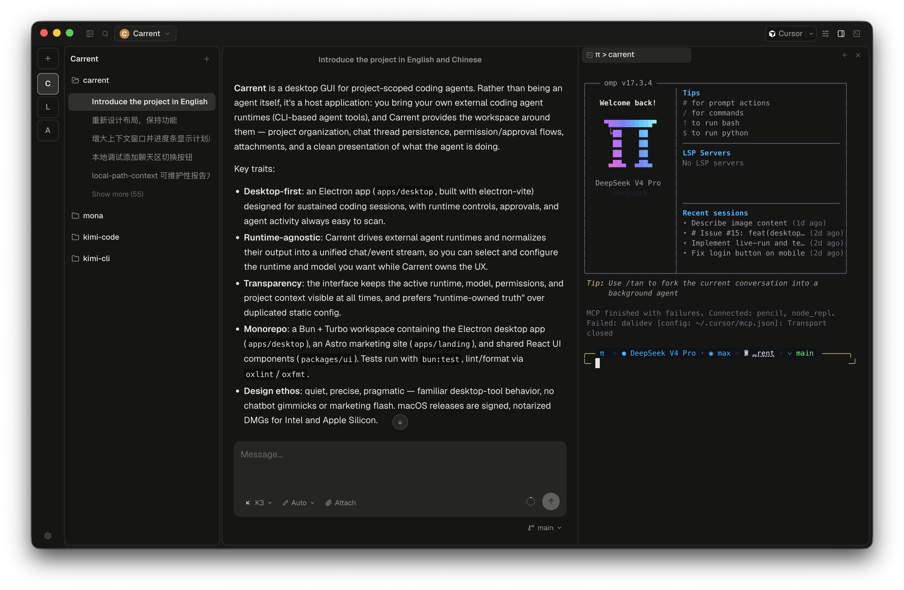

<p align="center">
  
</p>

<h1 align="center">Carrent</h1>

<p align="center">
  A calm, focused desktop workspace for your coding agents.
</p>

<p align="center">
  
</p>

## What is Carrent?

Carrent is a desktop GUI for project-scoped coding agents. Rather than being an
agent itself, it's a host application: you bring your own coding agent runtimes,
and Carrent provides the workspace around them — project organization, chat
thread persistence, permission and approval flows, attachments, and a clean
presentation of what the agent is doing.

## Why Carrent?

- **Your agents, your choice.** Carrent is runtime-agnostic. It drives external
  agent runtimes and normalizes their output into a unified chat and event
  stream, so you can switch runtimes and models without changing how you work.
- **Always know what's running.** The active runtime, model, permissions, and
  project context stay visible at all times. No hidden state, no surprises.
- **Built for long sessions.** Approvals, thread history, terminal sessions,
  and agent activity are designed to stay easy to scan without interrupting
  your flow.
- **A real desktop app.** Quiet, precise, and pragmatic — familiar desktop-tool
  behavior, no chatbot gimmicks or marketing flash.

## Get Carrent

macOS releases are signed and notarized DMGs for both Intel and Apple Silicon.
Grab the latest build from the
[Releases](https://github.com/Onion-L/carrent/releases) page.

> Carrent is a hobby project under active development. Features and APIs may
> change without notice. Thank you to everyone who has taken an interest in and
> supported the project.

## Development

Requires [Bun](https://bun.sh/).

```bash
bun install
bun run dev:desktop
```

See [CONTRIBUTING.md](CONTRIBUTING.md) and [AGENTS.md](AGENTS.md) for the full
development guide.
